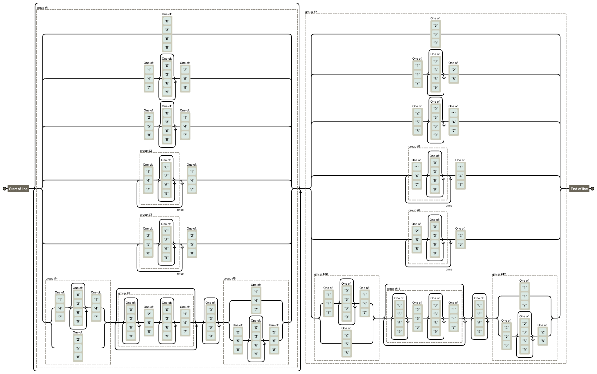
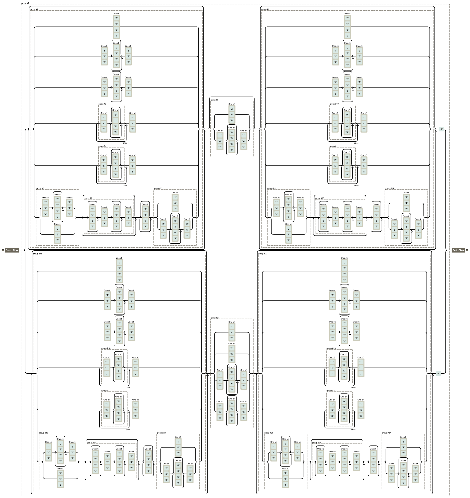
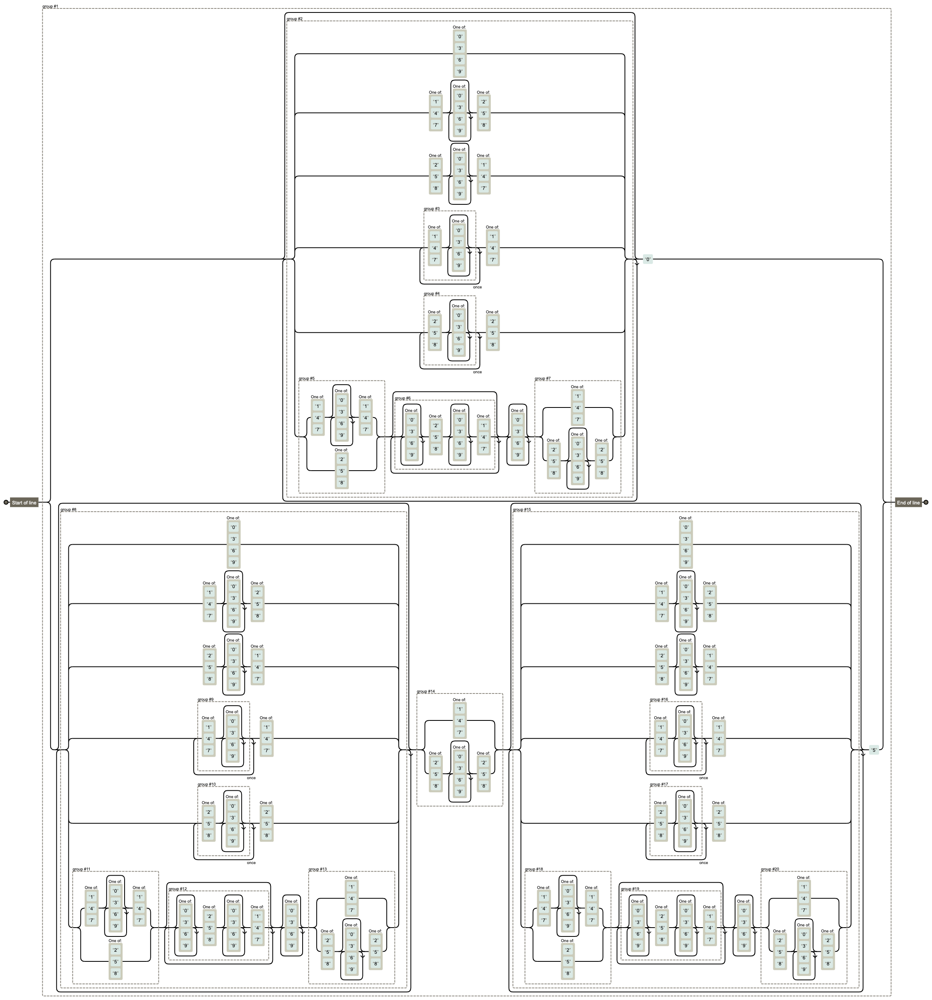

# fizzbuzz-regexp

FizzBuzz in RegExp

```console
$ FROM=57000000 TO=58000000 make
gcc fizzbuzz.c
./a.out 57000000 58000000 > answer.txt
perl fizzbuzz-regexp.pl 57000000 58000000 > result.txt
$ make diff
diff -s answer.txt result.txt || :
Files answer.txt and result.txt are identical
```

## summary

regexp and visualize with regexper

- `pbpaste | perl -pe 's| #.*$||' | tr -d ' \n' | pbcopy` will convert from perl-style to oneline regexp

## Fizz

```
^([0369]|[147][0369]*[258]|[258][0369]*[147]|([147][0369]*){2}[147]|([258][0369]*){2}[258]|([147][0369]*[147]|[258])([0369]*[258][0369]*[147])*[0369]*([147]|[258][0369]*[258]))*([369]|[147][0369]*[28]|[258][0369]*[147]|([147][0369]*){2}[147]|([258][0369]*){2}[28]|([147][0369]*[147]|[258])([0369]*[258][0369]*[147])*[0369]*([147]|[258][0369]*[28]))$
```

- [regexper](https://regexper.com/#%5E%28%5B0369%5D%7C%5B147%5D%5B0369%5D*%5B258%5D%7C%5B258%5D%5B0369%5D*%5B147%5D%7C%28%5B147%5D%5B0369%5D*%29%7B2%7D%5B147%5D%7C%28%5B258%5D%5B0369%5D*%29%7B2%7D%5B258%5D%7C%28%5B147%5D%5B0369%5D*%5B147%5D%7C%5B258%5D%29%28%5B0369%5D*%5B258%5D%5B0369%5D*%5B147%5D%29*%5B0369%5D*%28%5B147%5D%7C%5B258%5D%5B0369%5D*%5B258%5D%29%29*%28%5B369%5D%7C%5B147%5D%5B0369%5D*%5B28%5D%7C%5B258%5D%5B0369%5D*%5B147%5D%7C%28%5B147%5D%5B0369%5D*%29%7B2%7D%5B147%5D%7C%28%5B258%5D%5B0369%5D*%29%7B2%7D%5B28%5D%7C%28%5B147%5D%5B0369%5D*%5B147%5D%7C%5B258%5D%29%28%5B0369%5D*%5B258%5D%5B0369%5D*%5B147%5D%29*%5B0369%5D*%28%5B147%5D%7C%5B258%5D%5B0369%5D*%5B28%5D%29%29%24)
  - 

### Buzz

```
^(([0369]|[147][0369]*[258]|[258][0369]*[147]|([147][0369]*){2}[147]|([258][0369]*){2}[258]|([147][0369]*[147]|[258])([0369]*[258][0369]*[147])*[0369]*([147]|[258][0369]*[258]))*([258]|[147][0369]*[147])?([0369]|[147][0369]*[258]|[258][0369]*[147]|([147][0369]*){2}[147]|([258][0369]*){2}[258]|([147][0369]*[147]|[258])([0369]*[258][0369]*[147])*[0369]*([147]|[258][0369]*[258]))*5|([0369]|[147][0369]*[258]|[258][0369]*[147]|([147][0369]*){2}[147]|([258][0369]*){2}[258]|([147][0369]*[147]|[258])([0369]*[258][0369]*[147])*[0369]*([147]|[258][0369]*[258]))*([147]|[258]|[147][0369]*[147]|[258][0369]*[258])([0369]|[147][0369]*[258]|[258][0369]*[147]|([147][0369]*){2}[147]|([258][0369]*){2}[258]|([147][0369]*[147]|[258])([0369]*[258][0369]*[147])*[0369]*([147]|[258][0369]*[258]))*0)$
```

- [regexper](https://regexper.com/#%5E%28%28%5B0369%5D%7C%5B147%5D%5B0369%5D*%5B258%5D%7C%5B258%5D%5B0369%5D*%5B147%5D%7C%28%5B147%5D%5B0369%5D*%29%7B2%7D%5B147%5D%7C%28%5B258%5D%5B0369%5D*%29%7B2%7D%5B258%5D%7C%28%5B147%5D%5B0369%5D*%5B147%5D%7C%5B258%5D%29%28%5B0369%5D*%5B258%5D%5B0369%5D*%5B147%5D%29*%5B0369%5D*%28%5B147%5D%7C%5B258%5D%5B0369%5D*%5B258%5D%29%29*%28%5B258%5D%7C%5B147%5D%5B0369%5D*%5B147%5D%29%3F%28%5B0369%5D%7C%5B147%5D%5B0369%5D*%5B258%5D%7C%5B258%5D%5B0369%5D*%5B147%5D%7C%28%5B147%5D%5B0369%5D*%29%7B2%7D%5B147%5D%7C%28%5B258%5D%5B0369%5D*%29%7B2%7D%5B258%5D%7C%28%5B147%5D%5B0369%5D*%5B147%5D%7C%5B258%5D%29%28%5B0369%5D*%5B258%5D%5B0369%5D*%5B147%5D%29*%5B0369%5D*%28%5B147%5D%7C%5B258%5D%5B0369%5D*%5B258%5D%29%29*5%7C%28%5B0369%5D%7C%5B147%5D%5B0369%5D*%5B258%5D%7C%5B258%5D%5B0369%5D*%5B147%5D%7C%28%5B147%5D%5B0369%5D*%29%7B2%7D%5B147%5D%7C%28%5B258%5D%5B0369%5D*%29%7B2%7D%5B258%5D%7C%28%5B147%5D%5B0369%5D*%5B147%5D%7C%5B258%5D%29%28%5B0369%5D*%5B258%5D%5B0369%5D*%5B147%5D%29*%5B0369%5D*%28%5B147%5D%7C%5B258%5D%5B0369%5D*%5B258%5D%29%29*%28%5B147%5D%7C%5B258%5D%7C%5B147%5D%5B0369%5D*%5B147%5D%7C%5B258%5D%5B0369%5D*%5B258%5D%29%28%5B0369%5D%7C%5B147%5D%5B0369%5D*%5B258%5D%7C%5B258%5D%5B0369%5D*%5B147%5D%7C%28%5B147%5D%5B0369%5D*%29%7B2%7D%5B147%5D%7C%28%5B258%5D%5B0369%5D*%29%7B2%7D%5B258%5D%7C%28%5B147%5D%5B0369%5D*%5B147%5D%7C%5B258%5D%29%28%5B0369%5D*%5B258%5D%5B0369%5D*%5B147%5D%29*%5B0369%5D*%28%5B147%5D%7C%5B258%5D%5B0369%5D*%5B258%5D%29%29*0%29%24)
  - 

### FizzBuzz

```
^(([0369]|[147][0369]*[258]|[258][0369]*[147]|([147][0369]*){2}[147]|([258][0369]*){2}[258]|([147][0369]*[147]|[258])([0369]*[258][0369]*[147])*[0369]*([147]|[258][0369]*[258]))*0|([0369]|[147][0369]*[258]|[258][0369]*[147]|([147][0369]*){2}[147]|([258][0369]*){2}[258]|([147][0369]*[147]|[258])([0369]*[258][0369]*[147])*[0369]*([147]|[258][0369]*[258]))*([147]|[258][0369]*[258])([0369]|[147][0369]*[258]|[258][0369]*[147]|([147][0369]*){2}[147]|([258][0369]*){2}[258]|([147][0369]*[147]|[258])([0369]*[258][0369]*[147])*[0369]*([147]|[258][0369]*[258]))*5)$
```

- [regexper](https://regexper.com/#%5E%28%28%5B0369%5D%7C%5B147%5D%5B0369%5D*%5B258%5D%7C%5B258%5D%5B0369%5D*%5B147%5D%7C%28%5B147%5D%5B0369%5D*%29%7B2%7D%5B147%5D%7C%28%5B258%5D%5B0369%5D*%29%7B2%7D%5B258%5D%7C%28%5B147%5D%5B0369%5D*%5B147%5D%7C%5B258%5D%29%28%5B0369%5D*%5B258%5D%5B0369%5D*%5B147%5D%29*%5B0369%5D*%28%5B147%5D%7C%5B258%5D%5B0369%5D*%5B258%5D%29%29*0%7C%28%5B0369%5D%7C%5B147%5D%5B0369%5D*%5B258%5D%7C%5B258%5D%5B0369%5D*%5B147%5D%7C%28%5B147%5D%5B0369%5D*%29%7B2%7D%5B147%5D%7C%28%5B258%5D%5B0369%5D*%29%7B2%7D%5B258%5D%7C%28%5B147%5D%5B0369%5D*%5B147%5D%7C%5B258%5D%29%28%5B0369%5D*%5B258%5D%5B0369%5D*%5B147%5D%29*%5B0369%5D*%28%5B147%5D%7C%5B258%5D%5B0369%5D*%5B258%5D%29%29*%28%5B147%5D%7C%5B258%5D%5B0369%5D*%5B258%5D%29%28%5B0369%5D%7C%5B147%5D%5B0369%5D*%5B258%5D%7C%5B258%5D%5B0369%5D*%5B147%5D%7C%28%5B147%5D%5B0369%5D*%29%7B2%7D%5B147%5D%7C%28%5B258%5D%5B0369%5D*%29%7B2%7D%5B258%5D%7C%28%5B147%5D%5B0369%5D*%5B147%5D%7C%5B258%5D%29%28%5B0369%5D*%5B258%5D%5B0369%5D*%5B147%5D%29*%5B0369%5D*%28%5B147%5D%7C%5B258%5D%5B0369%5D*%5B258%5D%29%29*5%29%24)
  - 
